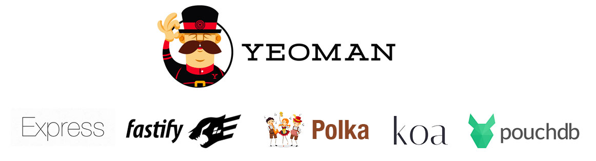

# Yeoman | Generator Standard REST API Projects [](https://github.com/RichardLitt/standard-readme)



## Description

🐒 Create Standard REST API Projects with [Yeoman](https://yeoman.io/).

With this generator you can build a standard REST API projects scaffoldings and tools with Express, Fastify, Polka or Koa frameworks and PouchDB for a local DB.

## 🏁 WIP

This project is alive and I'm currently working on improving it. The features implemented to date are:

✅ Core Project Yeoman. \
✅ Best Practices Doc. \
✅ Main libraries: TypeScript, ESLint, Nodemon, Jest + Supertest. \
✅ Custom libraries: PouchDB Wrapper. \
✅ Builder Express Project. \
✅ Builder Fastify Project. \
✅ Builder Koa Project. \
🔜 Builder Polka Project. \
✅ Unit Test.

## 📌 Methodologies and Guidelines

Quality Assurance Code (QAC)

* ESTlint, tool for identifying and reporting on patterns found in ECMAScript/JavaScript code. \
  [NPM ESLint](https://www.npmjs.com/package/eslint) \
  [NPM ESLint | Airbnb](https://www.npmjs.com/package/eslint-config-airbnb)

## ✅ Prerequisites

In order to work with this project, your local environment must have at least the following versions:

* NodeJS Version: 12.xx
* NPM Version: 6.12.0

## 📐 How to work with this project

First and foremost, you must have Node.js and npm installed. If you don't have Node.js installed, please download and install the latest version.

You must also install Yeoman, if you don't have it installed already. To install Yeoman, you can run this command:

```bash
# Install Yeoman
$npm i -g yo
```

With Node.js and Yeoman installed, you can run this command:

```bash
# Install Generator
$npm i -g generator-rest-api-projects
```

## 🚀 How to create my applications

Once installed you can generate a project by executing the following command.

```bash
# Run yeoman generator
$yo generator-rest-api-projects
```

## 📂 Code scaffolding

```any
/
├── assets 🌈               # Images Sources.
├── app 🚠
|   ├── config              # Generic config.
|   ├── templates           # Main files for template application.
|   |   ├── doc             # Common documentations for projects.
|   |   ├── env             # Main env files.
|   |   ├── eslit           # Configuration for ESLint.
|   |   ├── jest            # Configuration for Jest.
|   |   ├── nodemon         # Configuration for Nodemon.
|   |   ├── readme          # Main structure for Readme.md files.
|   |   ├── src             # Source JS projects.
|   |   |   ├── common      # Common folders and files for all servers.
|   |   |   ├── express     # Basic structure for Express Project.
|   |   |   ├── fastify     # Basic structure for Fastify Project.
|   |   |   ├── koa         # Basic structure for Koa Project.
|   |   |   └── polka       # Basic structure for Polka Project.
|   |   └── typescript      # Configuration for Typescript.
|   └── ...
└── ...
```

## 📦 Core and Libraries

This project is based on Yeoman library for create API REST projects with Express, Fastify, Koa and Polka frameworks.

* [Express](https://www.npmjs.com/package/express)
* [Fastify](https://www.npmjs.com/package/fastify)
* [Koa](https://www.npmjs.com/package/koa)
* [Polka](https://www.npmjs.com/package/polka)

## ⛽️ Review and Update Dependences

For review and update all npm dependences of this project you need install in global npm package "npm-check" npm module.

```bash
# Install and Run
$npm i -g npm-check
$npm-check
```

## Contact

🎓 [Linkedin](https://www.linkedin.com/in/josejpr/) \
🐦 [Twitter](https://twitter.com/JoseJ_PR) \
📧 me@josejpr.com

## License

[MIT](LICENSE.md)

## Happy Code

Created with JavaScript, lot of ❤️ and a few ☕️

## This README.md file has been written keeping in mind

* [GitHub Markdown](https://guides.github.com/features/mastering-markdown/)
* [Emoji Cheat Sheet](https://www.webfx.com/tools/emoji-cheat-sheet/)
